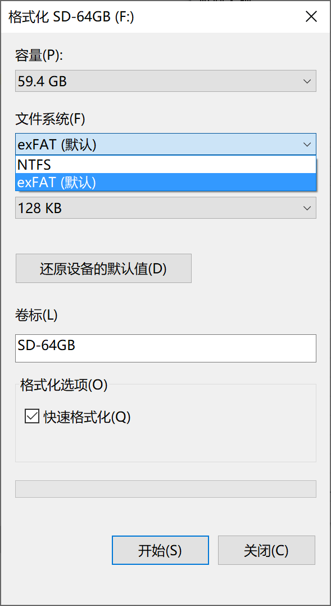
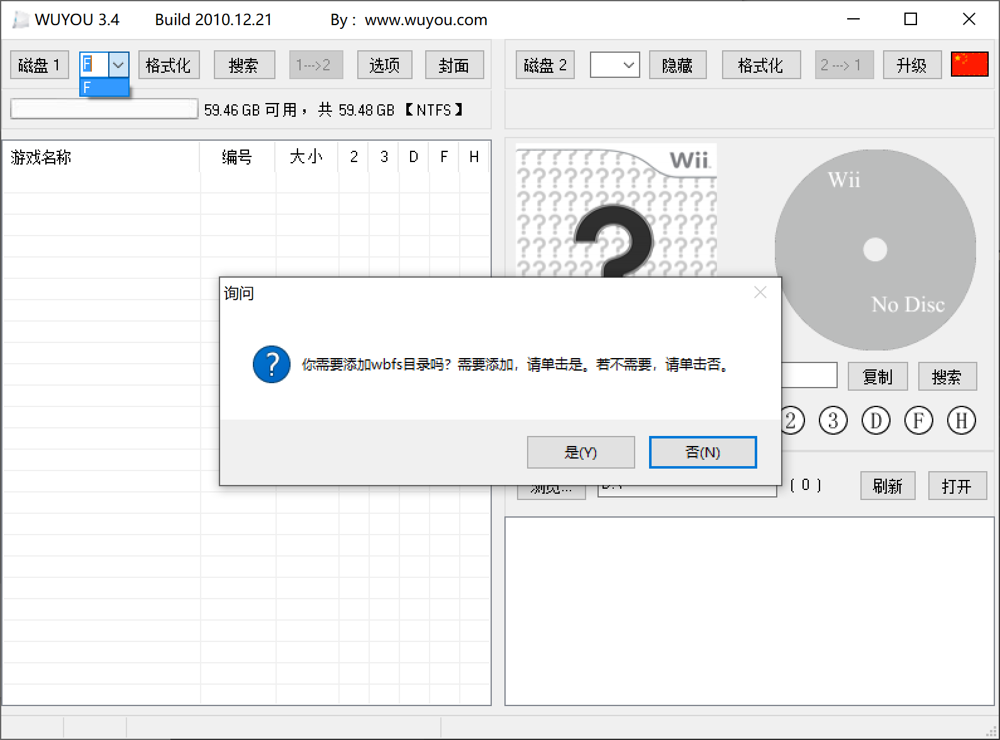
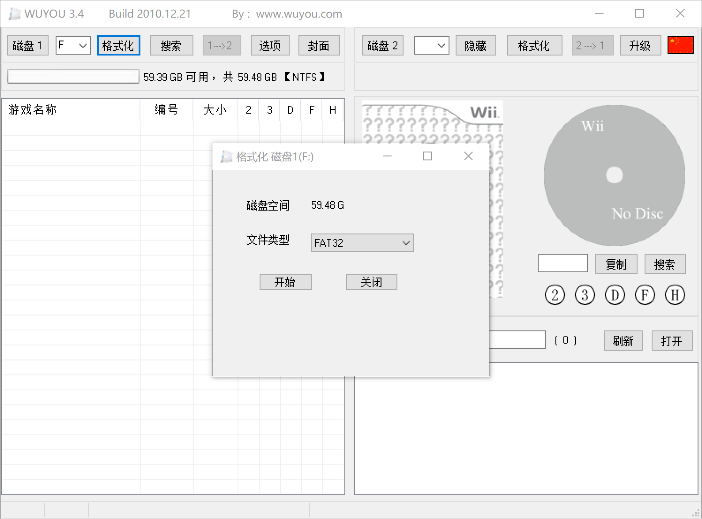

# 使用 WUYOU 格式化 SD 卡（FAT32）

## 说明

- Wii 外接 USB 设备玩游戏时，USB 设备的文件系统类型可以是 FAT32/NTFS/WBFS 中的任意一种，但是 Wii SD 卡插槽里面的这张卡只能是 FAT32 的；

- Windows 10 系统不能把大于 4GB 的分区格式化成 FAT32 的，使用 WUYOU 的格式化可以做到：

    

- U 盘或者移动硬盘的格式化操作类似，请读者自行举一反三。

下面演示如何使用 WUYOU 格式化 SD 卡：

## 1. 先用 Windows 的格式化把 SD 卡格式化成 NTFS

WUYOU 支持 FAT32/NTFS/WBFS 三种文件系统类型，而我的这张 SD 卡是 exFAT 的，所以在运行 WUYOU 之前，需要先格式化成 NTFS，否则 WUYOU 无法识别这张卡。

## 2. 选择 SD 卡对应的盘符

在界面左上角，“磁盘1”按钮后面的下拉列表中选择 SD 卡对应的盘符，如下图所示，我的 SD 卡在 F 盘。如果弹出询问窗口，请单击否。

## 3. 点“格式化”按钮，文件类型选择 FAT32，然后点“开始”按钮，耐心等待格式化结束

